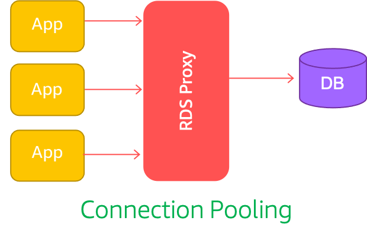
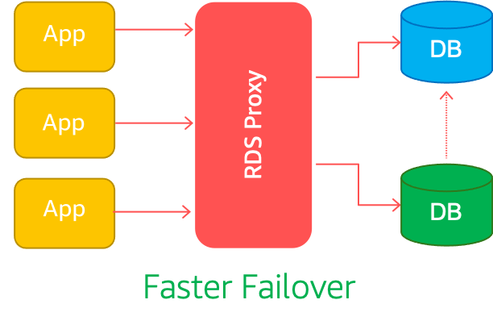
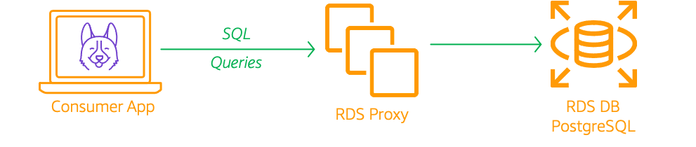
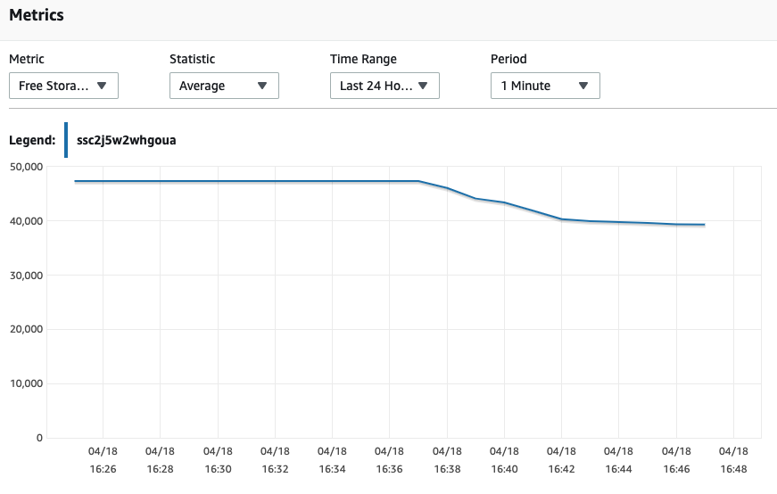
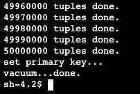
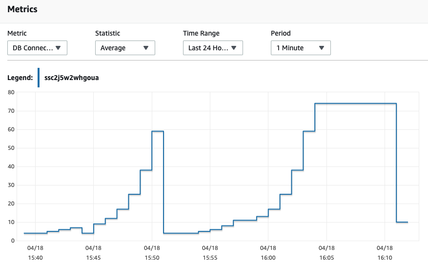
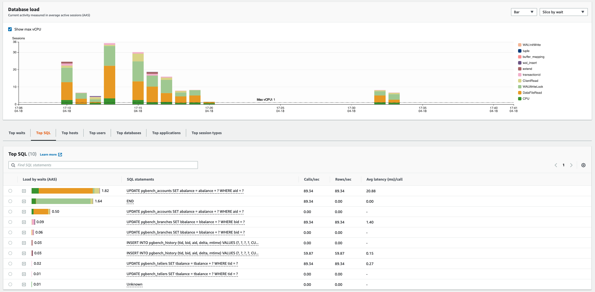
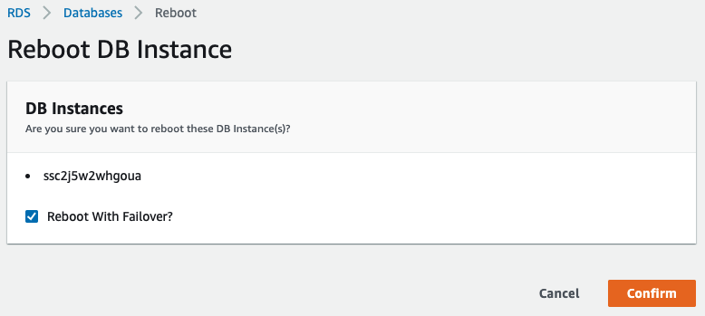

# Improve Databases Performance & Availability with RDS Proxy

Many applications built at Mystique Unicorn use modern serverless architectures like AWS Lambda, Fargate, Amazon ECS, or EKS. These applications can have a large number of open connections to the database server, and may open and close database connections at a high rate, exhausting database memory and compute resources.

Relational databases were built for a lower number of long-running compute instances. They were not designed for spiky character of an event driven workload. You will quickly exhaust the database connections pools by trying to open a lot of connections in a very short period of time. Another item that is of interest is reducing the applications recovery time after database failures. Even if you have two nodes, either you update the dns entries of the database endpoint or let your clients be aware of the newer endpoint to connect.

Can you help the Miztiik Unicorn team with PoC on how these two database problems can be solved?

## 🎯 Solutions

Amazon RDS Proxy<sup>[1]</sup> can front your Amazon RDS for MySQL/PostgreSQL and Aurora MySQL/PostgreSQL databases. It allows you to manage an application’s access to the database and provides _connection pooling, multiplexing, and graceful failover_. It helps you to scale beyond database connection limits and manage bursts of connections and requests from applications. This post focuses on the failover benefits of RDS Proxy.



Failover occurs when the primary database instance becomes inaccessible and another instance takes over as the new primary. This disrupts client connections. DNS propagation delay is the largest contributor to overall failover time.



With RDS Proxy, the applications can avoid the complexity associated with failover and experience faster recovery. RDS Proxy actively monitors database instances and automatically connects clients to the right target. It also maintains idle client connections through database failover without dropping them. Idle connections in this context are connections that don’t have outstanding requests.



We will build the above architecture in this demo. We will use `PostgreSQL 11.6`<sup>[2]</sup> for our RDS database and use `pgbench`<sup>[3]</sup>

1.  ## 🧰 Prerequisites

    This demo, instructions, scripts and cloudformation template is designed to be run in `us-east-1`. With few modifications you can try it out in other regions as well(_Not covered here_).

    - 🛠 AWS CLI Installed & Configured - [Get help here](https://youtu.be/TPyyfmQte0U)
    - 🛠 AWS CDK Installed & Configured - [Get help here](https://www.youtube.com/watch?v=MKwxpszw0Rc)
    - 🛠 Python Packages, _Change the below commands to suit your OS, the following is written for amzn linux 2_
      - Python3 - `yum install -y python3`
      - Python Pip - `yum install -y python-pip`
      - Virtualenv - `pip3 install virtualenv`

1.  ## ⚙️ Setting up the environment

    - Get the application code

      ```bash
      git clone https://github.com/miztiik/improve-db-perf-with-rds-proxy
      cd improve-db-perf-with-rds-proxy
      ```

1.  ## 🚀 Prepare the dev environment to run AWS CDK

    We will use `cdk` to make our deployments easier. Lets go ahead and install the necessary components.

    ```bash
    # You should have npm pre-installed
    # If you DONT have cdk installed
    npm install -g aws-cdk

    # Make sure you in root directory
    python3 -m venv .venv
    source .venv/bin/activate
    pip3 install -r requirements.txt
    ```

    The very first time you deploy an AWS CDK app into an environment _(account/region)_, you’ll need to install a `bootstrap stack`, Otherwise just go ahead and deploy using `cdk deploy`.

    ```bash
    cdk bootstrap
    cdk ls
    # Follow on screen prompts
    ```

    You should see an output of the available stacks,

    ```bash
    improve-db-perf-with-rds-proxy-vpc-stack
    store-events-db-stack
    store-events-consumer-stack
    store-events-db-proxy-stack
    ```

1.  ## 🚀 Deploying the application

    Let us walk through each of the stacks,

    - **Stack: store-events-db-stack**

      For the RDS database, we will use `PostgreSQL 11.6`<sup>[2]</sup>. This stack will also create the vpc, subnets, route tables using the stack `improve-db-perf-with-rds-proxy-vpc-stack`. We will be using the same VPC for hosting our RDS Consumer on EC2 server. The RDS instance will be hosted in the private subnet and the security group is configured to allow port `5432` connections from within the VPC. The database is has the following configurations,

      - Database Name: `store_events`
      - DB Engine Version: `11.6.x`
      - DB Username: `mystiquemaster`
      - DB Password: Auto generated and stored in AWS Secrets Manager
      - Parameter & Option Group: Defaults

      Initiate the deployment with the following command,

      ```bash
      cdk deploy improve-db-perf-with-rds-proxy-vpc-stack
      cdk deploy store-events-db-stack
      ```

      After successfully deploying the stack, Check the `Outputs` section of the stack. You will find the DB Resource `StoreEventsDatabase`. You will find the credentials to connect to the database in secrets manager arn `StoreEventsDatabaseSecretArn`. The sample command to connect to the db with a cli can also be found there.

    - **Stack: store-events-consumer-stack**

      To perform database tests on the RDS db, We will use an ec2 instance. The EC2 instance will be launched in the public subnet along with a IAM Role that supports SSM Session Manager access<sup>[2]</sup>. This Ec2 instance is configured to be bootstrapped with PostgreSQL client libraries to enable connections to RDS. Take a look at the userdata scripts at `stacks/back_end/store_events_consumer_on_ec2_stack/bootstrap_scripts/deploy_app.sh` if you want to modify them or improve them to add your own libraries.

      Initiate the deployment with the following command,

      ```bash
      cdk deploy store-events-consumer-stack
      ```

      After successfully deploying the stack, Check the `Outputs` section of the stack. You will find the instance `Ec2ConsumerInstance`.

    - **Stack: store-events-db-proxy-stack**

      This stack will create Amazon RDS Proxy<sup>[1]</sup> in the same VPC as the RDS database and within the same SG as the DB. In production you want to consider using different SGs for each of them. I have configured the proxy to maintain idle connections for a maximum of `10` minutes. After that those connections will be released.

      Initiate the deployment with the following command,

      ```bash
      cdk deploy store-events-db-proxy-stack
      ```

      After successfully deploying the stack, Check the `Outputs` section of the stack. You will find the `StoreEventsDbProxy` resource.

1.  ## 🔬 Testing the solution

    1.  **Connect To OLTP consumer ON EC2**:
        Connect to the `Ec2ConsumerInstance` instance using SSM Session Manager<sup>[2]</sup>. Get the rds credentials and connection information from AWS Secrets Manager `StoreEventsDatabaseSecretArn`. Although you can type the hostname, port and db name everything, it is better to set them as variables and re-use them for testing.

        ```bash
        DB_ENDPOINT="ssc2j5w2whgoua.ca4q8ficuhu.us-east-1.rds.amazonaws.com"
        DB_PROXY_ENDPOINT="store-events-db-proxy.proxy-ca4q8ficuhu.us-east-1.rds.amazonaws.com"
        DB_PORT="5432"
        DB_NAME="store_events"
        DB_USER_NAME="mystiquemaster"
        DB_PASSWORD="OBVIOUSLY_YOUR_PASSWORD_GOES_HERE"
        S3_PREFIX="store_events"
        # Initialize the database with some data for testing
        PGPASSWORD=${DB_PASSWORD} pgbench -h ${DB_ENDPOINT} -p ${DB_PORT} -U ${DB_USER_NAME} -d ${DB_NAME} -i -s 500
        ```

        The initialization will take a few minutes to complete. Until it completes the loading process, you can check out the RDS Database Metrics in the console. You should be able to observe increased CPU usage and the free storage space decreasing.

        

        After the initialization is complete, We will perform two tests. The first one will connect directly to the database endpoint and in the second one we will connect to the db using the proxy endpoint and see how the connection scaling works.
        

        - **Test: Connections-To-DB**

        We will set up `70` clients using `-c` option and run the test for a duration of `60` seconds. If you want you can increase no. of threads using `-j` option. For now let us begin,

        ```bash
        > PGPASSWORD=${DB_PASSWORD} pgbench -h ${DB_ENDPOINT} -p ${DB_PORT} -U ${DB_USER_NAME} -d ${DB_NAME} -c 70 -T 60
        ...
        transaction type: TPC-B (sort of)
        scaling factor: 500
        query mode: simple
        number of clients: 70
        number of threads: 1
        duration: 60 s
        number of transactions actually processed: 32308
        tps = 537.058231 (including connections establishing)
        tps = 546.439557 (excluding connections establishing)
        ```

        - **Test: Connections-To-Proxy**

        ```bash
        > PGPASSWORD=${DB_PASSWORD} pgbench -h ${DB_PROXY_ENDPOINT} -p ${DB_PORT} -U ${DB_USER_NAME} -d ${DB_NAME} -c 70 -T 60
        ...
        transaction type: TPC-B (sort of)
        scaling factor: 500
        query mode: simple
        number of clients: 70
        number of threads: 1
        duration: 60 s
        number of transactions actually processed: 30484
        tps = 507.638955 (including connections establishing)
        tps = 520.950778 (excluding connections establishing)
        ```

        If you run the tests multiple times, you will notice the number of transactions to settle around the same number, but when connecting to the proxy you should be able to support more client connections. For example, You can notice that I have chosen the number of clients to be `70` anything more with the direct to DB will fail, whereas you can have more clients with the proxy setup. Go ahead try increasing them and play around with them.

        

        In the above snapshot, The second spike is from running pgbench against the proxy endpoint. You can observe that the rate of increase is spread over time giving your db the much needed breather to catch up with spiky requests. You can also `10` different tests in a loop. Each time we will increase the number of connections(_following a fibonacci pattern_) and then observe the connections in cloudwatch

        ```bash
        for i in 1 2 3 5 8 13 21 34 55 89; do sleep 5; PGPASSWORD=${DB_PASSWORD} pgbench -h ${DB_PROXY_ENDPOINT} -p ${DB_PORT} -U ${DB_USER_NAME} -d ${DB_NAME} -c $i -T 60;done
        ```

        You can use RDS Performance Insights to identify the queries that are being run and the ones that is causing lot of load on CPU or waiting for data from disk to uncover potential performance issues.

        

        You can see that there are no tables under our database `store_events`.

    1.  **FailOver Recovery**:

        - **Test: Connections-To-DB**

        Let us perform a failover test, by manually triggering a reboot with failover option from the RDS console. Before you do that, initiate the following command from the consumer in EC2. This should run a query against the database server to get the current time in a infinite loop. We will use those timestamps to find out how long it takes to recover from a failure.

        ```bash
        while true; \
        do \
        PGPASSWORD=${DB_PASSWORD} \
        psql \
        -h ${DB_ENDPOINT} \
        -p ${DB_PORT} \
        -U ${DB_USER_NAME} \
        -d ${DB_NAME} \
        -c "SELECT CURRENT_TIME;"; \
        sleep .5; \
        done
        ```

        

        ```text
          current_time
        -------------------
        18:31:42.46637+00
        (1 row)

            current_time
        --------------------
        18:31:42.985845+00
        (1 row)

            current_time
        --------------------
        18:31:43.505596+00
        (1 row)

        psql: could not connect to server: Connection timed out
                Is the server running on host "ssc2j5w2whgoua.ca64q8ficuhu.us-east-1.rds.amazonaws.com" (10.10.2.135) and accepting
                TCP/IP connections on port 5432?
            current_time
        --------------------
        18:33:55.083264+00
        (1 row)

            current_time
        --------------------
        18:33:55.606506+00
        (1 row)
        (1 row)
        ```

        You can see that, It has taken about `132` seconds to recover from failure

        - **Test: Connections-To-Proxy**

        Now run this query, this will query the time against the proxy endpoint and trigger a reboot with failover from the console.

        ```bash
        while true; \
        do \
        PGPASSWORD=${DB_PASSWORD} \
        psql \
        -h ${DB_PROXY_ENDPOINT} \
        -p ${DB_PORT} \
        -U ${DB_USER_NAME} \
        -d ${DB_NAME} \
        -c "SELECT CURRENT_TIME;"; \
        sleep .5; \
        done
        ```

        ```text
            current_time
        --------------------
        18:41:12.679197+00
        (1 row)

            current_time
        --------------------
        18:41:13.209632+00
        (1 row)

            current_time
        --------------------
        18:41:13.741972+00
        (1 row)

        SSL connection has been closed unexpectedly
        connection to server was lost
            current_time
        --------------------
        18:41:34.426217+00
        (1 row)

            current_time
        --------------------
        18:41:34.986858+00
        (1 row)
        ```

        You can see that, It has taken about `21` seconds to recover from failure. Definitely proxy has reduced the time to connect to the active node.

1.  ## 📒 Conclusion

    Here we have demonstrated how to use RDS Proxy to improve performance and recover times of your database. You can extend this further by using proxy the pin sessions.

1.  ## 🧹 CleanUp

    If you want to destroy all the resources created by the stack, Execute the below command to delete the stack, or _you can delete the stack from console as well_

    - Resources created during [Deploying The Application](#-deploying-the-application)
    - Delete CloudWatch Lambda LogGroups
    - _Any other custom resources, you have created for this demo_

    ```bash
    # Delete from cdk
    cdk destroy

    # Follow any on-screen prompts

    # Delete the CF Stack, If you used cloudformation to deploy the stack.
    aws cloudformation delete-stack \
      --stack-name "MiztiikAutomationStack" \
      --region "${AWS_REGION}"
    ```

    This is not an exhaustive list, please carry out other necessary steps as maybe applicable to your needs.

## 📌 Who is using this

This repository aims to show how to use RDS Proxy for database performance to new developers, Solution Architects & Ops Engineers in AWS. Based on that knowledge these Udemy [course #1][102], [course #2][101] helps you build complete architecture in AWS.

### 💡 Help/Suggestions or 🐛 Bugs

Thank you for your interest in contributing to our project. Whether it is a bug report, new feature, correction, or additional documentation or solutions, we greatly value feedback and contributions from our community. [Start here](/issues)

### 👋 Buy me a coffee

[](https://ko-fi.com/Q5Q41QDGK) Buy me a [coffee ☕][900].

### 📚 References

1. [AWS Docs: RDS Proxy][1]
1. [AWS Docs: RDS Proxy prerequisites and limitations apply to PostgreSQL][2]
1. [Docs: PostgreSQL Pgbench][3]

### 🏷️ Metadata


**Level**: 300

[1]: https://aws.amazon.com/rds/proxy/
[2]: https://docs.aws.amazon.com/AmazonRDS/latest/AuroraUserGuide/rds-proxy.html#rds-proxy-connecting
[3]: https://www.postgresql.org/docs/10/pgbench.html
[100]: https://www.udemy.com/course/aws-cloud-security/?referralCode=B7F1B6C78B45ADAF77A9
[101]: https://www.udemy.com/course/aws-cloud-security-proactive-way/?referralCode=71DC542AD4481309A441
[102]: https://www.udemy.com/course/aws-cloud-development-kit-from-beginner-to-professional/?referralCode=E15D7FB64E417C547579
[103]: https://www.udemy.com/course/aws-cloudformation-basics?referralCode=93AD3B1530BC871093D6
[899]: https://www.udemy.com/user/n-kumar/
[900]: https://ko-fi.com/miztiik
[901]: https://ko-fi.com/Q5Q41QDGK
